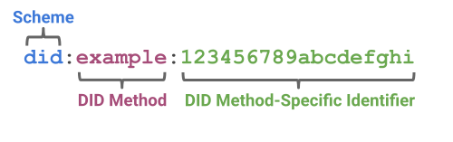

## DID
Decentralized identifiers (DIDs) are a new type of identifier that enables verifiable, decentralized digital identity. A DID refers to any subject (e.g., a person, organization, thing, data model, abstract entity, etc.) as determined by the controller of the DID. In contrast to typical, federated identifiers, DIDs have been designed so that they may be decoupled from centralized registries, identity providers, and certificate authorities. Specifically, while other parties might be used to help enable the discovery of information related to a DID, the design enables the controller of a DID to prove control over it without requiring permission from any other party. DIDs are URIs that associate a DID subject with a DID document allowing trustable interactions associated with that subject.



The example DID above resolves to a DID document. A DID document contains information associated with the DID, such as ways to cryptographically authenticate a DID controller.

```
{
  "@context": [
    "https://www.w3.org/ns/did/v1",
    "https://w3id.org/security/suites/ed25519-2020/v1"
  ]
  "id": "did:example:123456789abcdefghi",
  "authentication": [{
    
    "id": "did:example:123456789abcdefghi#keys-1",
    "type": "Ed25519VerificationKey2020",
    "controller": "did:example:123456789abcdefghi",
    "publicKeyMultibase": "zH3C2AVvLMv6gmMNam3uVAjZpfkcJCwDwnZn6z3wXmqPV"
  }]
}
```

Decentralized Identifiers are a component of larger systems, such as the Verifiable Credentials ecosystem [VC-DATA-MODEL], which influenced the design goals for this specification. The design goals for Decentralized Identifiers are summarized here.
